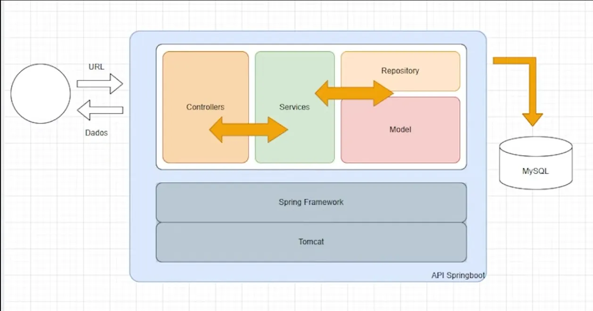

# 🎉 Event API - Sistema de Eventos com Indicação

Este é um projeto desenvolvido em **Java** utilizando **Spring Boot**, que implementa uma API para **criação de eventos**, **inscrição de usuários**, **geração de links de indicação** e um **ranking de usuários mais influentes**.

## 🚀 Tecnologias Utilizadas

- **Java 21**  
- **Spring Boot**  
  - Spring Data JPA  
  - Spring Boot DevTools  
  - MySQL Driver  
  - Spring Web  
- **Banco de Dados:** MySQL  
- **Ferramentas:**  
  - MySQL Workbench  
  - IntelliJ IDEA  
  - Postman  

## 🏷 Arquitetura

O projeto segue a arquitetura **Controller - Service - Repository - Model**, garantindo organização e escalabilidade.


## 📌 Funcionalidades

- **Cadastro de eventos** 🎭  
- **Inscrição de usuários em eventos** 📝  
- **Geração de link de indicação** 🔗  
  - Cada usuário recebe um **link único** usando **Pretty Name** para convidar novas pessoas.  
  - Ao se cadastrar através do link, o usuário que indicou ganha **pontos**.  
- **Ranking de usuários mais influentes** 🏆  
  - Lista os usuários com **mais indicações bem-sucedidas**.  

## 📚 User Stories

Para descrever os casos de uso e funcionalidades da API, utilizamos **User Stories**, garantindo clareza e foco nos requisitos do usuário.

## 📦 Como Executar o Projeto

1. Clone o repositório:
   ```sh
   git clone https://github.com/seu-usuario/nlw-connect-java.git
   ```

## 🔍 Endpoints da API

### 🎭 Eventos

#### Criar um novo evento
- **POST** `/events`
- **Corpo da requisição:**
  ```json
  {
    "name": "Nome do Evento",
    "date": "2025-03-06T19:00:00",
    "prettyName": "evento-exemplo"
  }
  ```
- **Resposta:**
  ```json
  {
    "id": 1,
    "name": "Nome do Evento",
    "date": "2025-03-06T19:00:00",
    "prettyName": "evento-exemplo"
  }
  ```

#### Listar todos os eventos
- **GET** `/events`
- **Resposta:**
  ```json
  [
    {
      "id": 1,
      "name": "Evento Exemplo",
      "date": "2025-03-06T19:00:00",
      "prettyName": "evento-exemplo"
    }
  ]
  ```

#### Buscar evento pelo Pretty Name
- **GET** `/events/{prettyName}`
- **Resposta:**
  ```json
  {
    "id": 1,
    "name": "Evento Exemplo",
    "date": "2025-03-06T19:00:00",
    "prettyName": "evento-exemplo"
  }
  ```

### 👤 Inscrição

#### Criar inscrição em um evento
- **POST** `/subscription/{prettyName}` ou `/subscription/{prettyName}/{userId}`
- **Corpo da requisição:**
  ```json
  {
    "name": "Nome do Usuário",
    "email": "usuario@email.com"
  }
  ```
- **Resposta:**
  ```json
  {
    "message": "Inscrição realizada com sucesso!"
  }
  ```

#### Obter ranking dos 3 melhores indicados
- **GET** `/subscription/{prettyName}/ranking`
- **Resposta:**
  ```json
  [
    {
      "userId": 1,
      "name": "Usuário 1",
      "points": 10
    },
    {
      "userId": 2,
      "name": "Usuário 2",
      "points": 7
    },
    {
      "userId": 3,
      "name": "Usuário 3",
      "points": 5
    }
  ]
  ```

#### Obter ranking de um usuário específico
- **GET** `/subscription/{prettyName}/ranking/{userId}`
- **Resposta:**
  ```json
  {
    "userId": 1,
    "name": "Usuário 1",
    "rank": 1,
    "points": 10
  }
  ```

